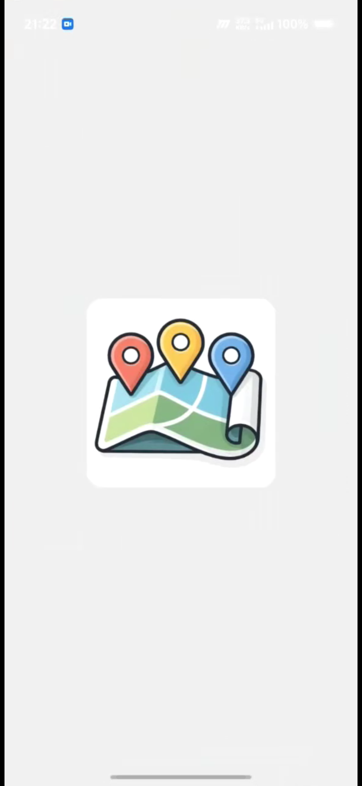
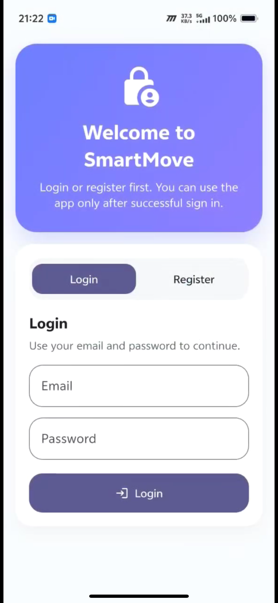
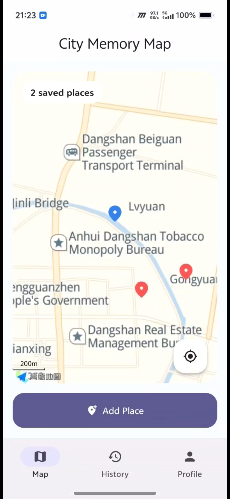
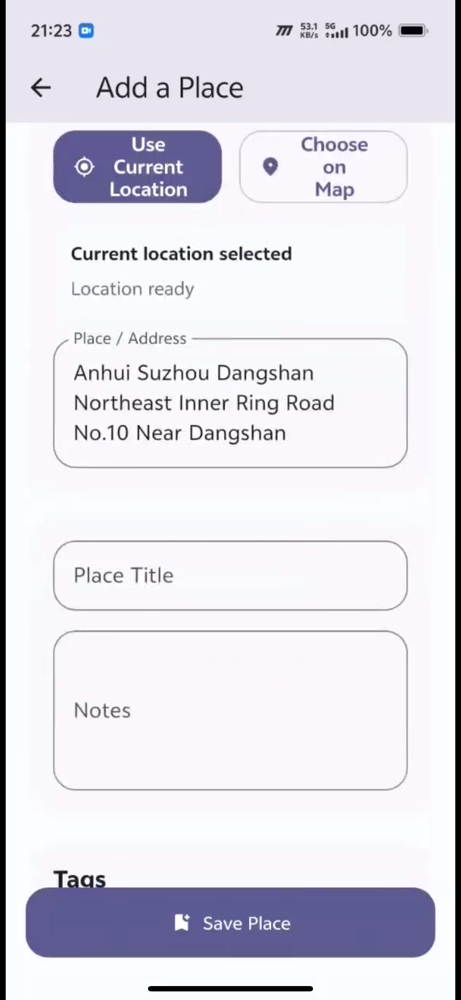
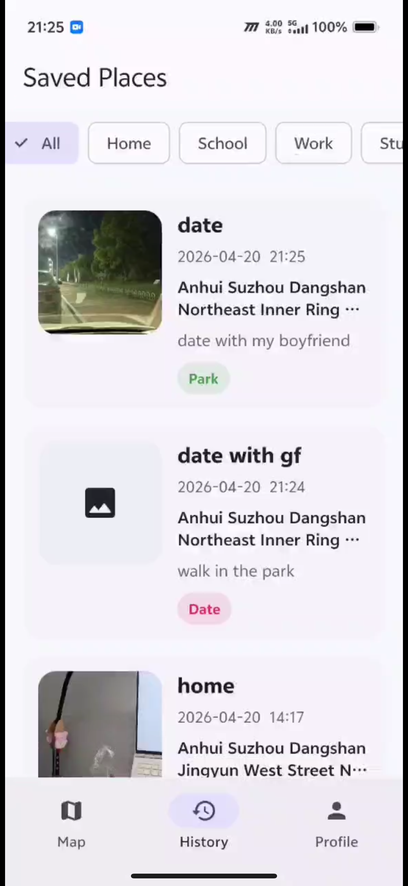
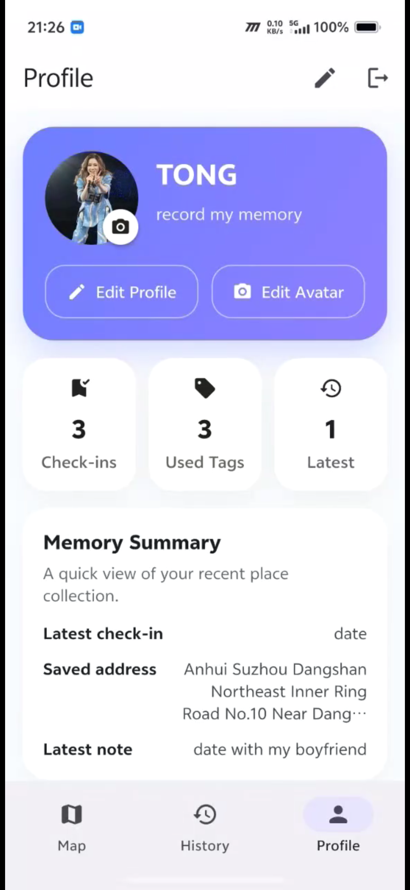

# SmartMove 📍
### A City Memory Map built with Flutter

  

  <strong>Save places. Keep memories. Move meaningfully.</strong>

  SmartMove is a Flutter mobile application that helps users record meaningful places in everyday life.
  By combining live location, map selection, notes, photos, and tags, the app turns ordinary places into a personal memory archive.

  <a href="https://tongtong828.github.io/smartmove/"><strong>Landing Page</strong></a> ·
  <a href="https://github.com/Tongtong828/smartmove"><strong>GitHub Repository</strong></a> ·
  <a href="https://tongtong828.github.io/smartmove/"><strong>GitHub landing page</strong></a> ·
  <a href="docs/smartmove_video.mp4"><strong>Demo Video</strong></a>

---

## Project Overview

SmartMove is a location-based mobile app developed for the **CASA0015 Mobile Systems & Interactions Final Assessment**.

Rather than using maps only for navigation, SmartMove uses mobile sensing and map interaction to help users save meaningful places. Each saved entry can include a title, address, note, image, and tags, allowing the user to build a lightweight but personal record of places over time.

This project is designed around the theme of **Connected Environments**, connecting:

- the **physical environment** through mobile location sensing
- the **digital environment** through map services and saved records
- the **personal environment** through notes, memories, and repeated interaction

---

## Problem Statement

Many places matter to people for reasons beyond navigation.  
A café, a school building, a park, or a quiet street corner may carry memory, routine, or emotion, but most map apps do not preserve that personal meaning.

SmartMove addresses this problem by allowing users to:

- capture a place using current location or map selection
- save notes, images, and tags
- revisit places later through a history view
- build a personal place-memory archive over time

---

## Key Features

- **Splash Screen**  
  A clear branded entry point for the app.

- **Login / Register**  
  Users enter through an authentication gate before accessing the application.

- **Home Map**  
  A large map-based homepage showing current location and saved place markers.

- **Add a Place**  
  Users can save a new place using either live location or manual map selection.

- **Notes, Photos and Tags**  
  Each place can be enriched with personal context.

- **Saved Places / History**  
  Entries are stored and revisited later, supporting repeat use over time.

- **Profile Page**  
  Users can edit avatar, name, and signature, and log out from the app.

---

## App Screens

  <strong>Main app screens</strong>

<table>
  <tr>
    <td align="center">
      
       
      <b>Splash Screen</b>
    </td>
    <td align="center">
      
       
      <b>Login / Register Page</b>
    </td>
    <td align="center">
      
       
      <b>Home Map Page</b>
    </td>
  </tr>
  <tr>
    <td align="center">
      
       
      <b>Add Place Page</b>
    </td>
    <td align="center">
      
       
      <b>Saved Places / History Page</b>
    </td>
    <td align="center">
      
       
      <b>Profile Page</b>
    </td>
  </tr>
</table>

---

## Demo Video

  

  <a href="docs/smartmove_video.mp4"><strong>▶ Watch the SmartMove Demo Video</strong></a>

---

## Landing Page

The project landing page is available here:

**[Open the SmartMove Landing Page](https://tongtong828.github.io/smartmove/)**

---

## Why This App Fits Connected Environments

SmartMove fits the Connected Environments theme because it connects real-world place sensing with personal digital memory.

The app uses:

- **mobile location sensing**
- **interactive map services**
- **data logging over time**
- **user-generated content**
- **repeat interaction across multiple views**

Rather than acting as a simple map utility, SmartMove uses connected mobile technology to support reflection, memory, and place-based storytelling.

---

## Technical Integration

This project was developed in **Flutter** and uses the following technologies and packages:

- **Flutter**
- **Dart**
- **AMap Map SDK**
- **AMap location services**
- **Reverse geocoding service**
- **SharedPreferences**
- **Image Picker**
- **Path Provider**
- **Local auth flow**

The app integrates mobile sensing and external services through:

- live location updates
- map rendering
- place markers
- reverse geocoding
- local storage of place records
- login / register gate flow

---

## Data Collection and Handling

SmartMove stores lightweight user-generated data locally, including:

- title
- address
- note
- latitude and longitude
- image path
- tags
- profile name
- profile signature
- avatar path

This information is used to support the user’s personal archive of places and is displayed across the home, history, detail, and profile views.

---

## User Journey

The app flow is designed to be simple and clear:

**Splash → Login/Register → Home Map → Add Place → Save → History → Detail → Profile**

This creates a complete interaction loop where the user not only captures a place in the moment, but can also revisit it later.

---

